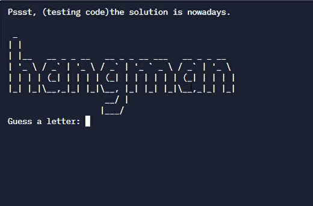
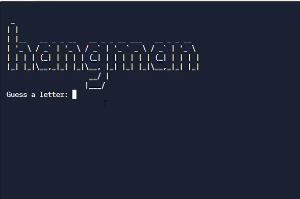
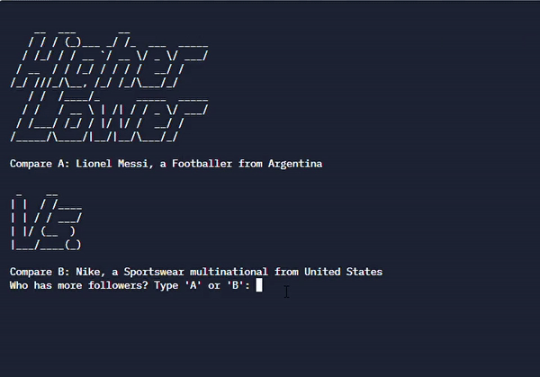

# Python-projects
## Basic projects 
List of all the python basic projects (click on the name of the project to go to the file and run it yourself): 
1. [Password Generator](https://replit.com/@preetpalsinghsp/password-generator-start#Password%20Generator.py)
This code generates random password based on the input given by user, the password is always gonna be a different combination of latters, numbers and symbols in a random order.
 
 - - - -
 
2. [Hangman](https://replit.com/@preetpalsinghsp/Hangman)
**Save the poor stickman, who was caught for using fake credit cards**
Well it's a game why don't you go ahead and try it yourself first. So what it does is it will ask you to guess some letters of a word and you will have 6 lives. if you guess a letter which is not in word you loose a life :( and the poor stickman would be one step closer to death. So test your vocabulary and i am sure you will win most of the times.

|  |  |
|:--:| :--:|
| **Win** | **Loose** |

The flow chart:

 - - - -
 
3. [High-low](https://replit.com/@preetpalsinghsp/higher-lower-start#main.py)This is a high low game, in this you have to guess which of the shown celebrity has higher number of followers on instagram. if you get it right you move to the next round else the game ends when you get a choice wrong.

  you can try an online version of this game here:
  http://www.higherlowergame.com/

|  |
|:--:|
| **Example of the program** |

